# 🧠 Jump AI Agent – Financial Advisor Assistant

---

> **🚀 Built in 48 Hours!**
>
> This project demonstrates advanced AI engineering and rapid product delivery. All core features—including Retrieval-Augmented Generation (RAG), Task Scheduling, Tool Calling, and real-time webhooks—were fully implemented and production-ready within just 48 hours. The app persistently stores all chat history in the database, and uses real-time webhooks to update vector embeddings instantly whenever new emails, calendar events, or tasks are created. This ensures the AI agent always has the most up-to-date context for every user interaction.
>
> **Key Achievements:**
> - ⚡️ End-to-end RAG pipeline for semantic search across Gmail , Calendar and HubSpot
> - 🗂️ All chat history and tasks are stored and retrievable from the database
> - 🔄 Real-time webhooks keep embeddings and context always fresh
> - 🛠️ Flexible tool calling for seamless automation and task continuation
> - ⏱️ Delivered in record time: 48 hours from start to finish

---

A production-ready AI agent for Financial Advisors, integrating Gmail, Google Calendar, and HubSpot CRM. The app provides a ChatGPT-like interface for client Q&A, task automation, and proactive workflows using RAG, tool calling, and persistent memory.

---

## 🚀 Live Demo

**App URL 👉** https://jump-app.netlify.app/
>**⚠️ Note:** The backend is hosted on a demand-based Render instance. It may take a few seconds/minutes to wake up if idle. Please wait a moment before logging in to ensure the session is initialized properly.
>
>✅ Once active, the full app flow—including login, session handling, and all key features—will function as intended.

**Demo Video URL: 👉** [https://youtu.be/sckcaKYOy7A]

---

## 🛠 Tech Stack

- **Frontend:** React, Vite, Tailwind CSS
- **Backend:** FastAPI (Python)
- **AI:** OpenAI GPT-4o (tool calling + RAG)
- **Database:** Supabase (Postgres + pgvector)
- **OAuth:** Google OAuth2, HubSpot OAuth
- **Deployment:** Render (backend), Vercel (frontend)
- **APIs:** Gmail, Google Calendar, HubSpot CRM

---

## 📦 Installation Instructions

1. **Clone the repository**
   ```bash
   git clone <repository-url>
   cd jump-app
   ```

2. **Install dependencies**
   ```bash
   # Backend
   pip install -r requirements.txt

   # Frontend
   cd frontend
   npm install
   ```

3. **Set up environment variables**
   - Copy `.env.example` to `.env` and fill in your API keys and secrets.

4. **Set up the database**
   ```bash
   python setup_database.py
   # Or manually run database_schema.sql in Supabase
   ```

5. **Run the app locally**
   ```bash
   # Backend
   cd backend
   uvicorn app.main:app --reload

   # Frontend
   cd frontend
   npm run dev
   ```

---

## ✨ How It Works / Features

### 1. Home Page
Main screen of Jump application
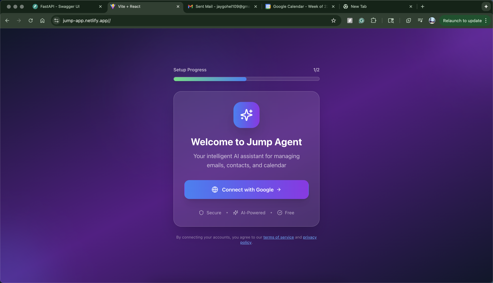

### 2. Google OAuth Login
Log in securely with Google, granting email and calendar permissions.
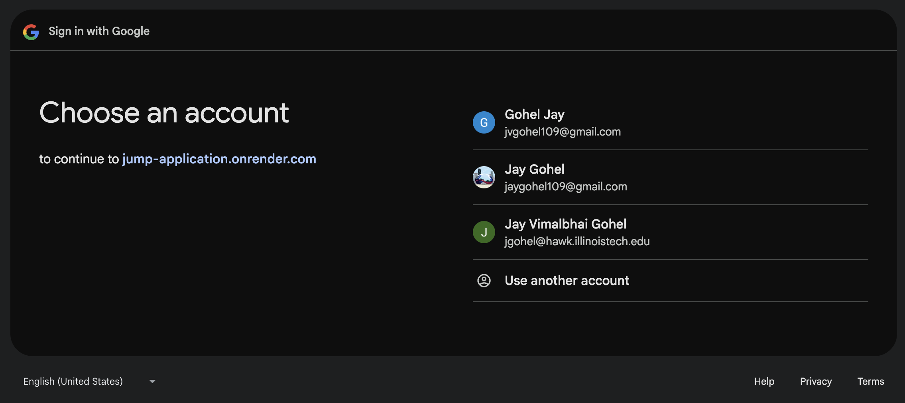
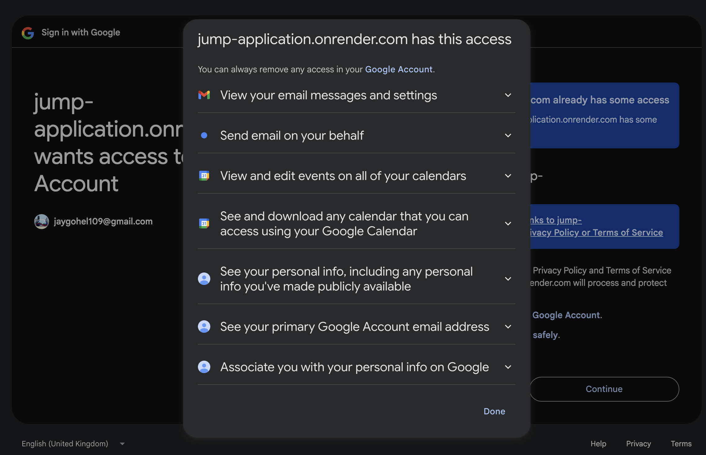

### 3. Connect HubSpot CRM
Authenticate and connect your HubSpot account for CRM access.
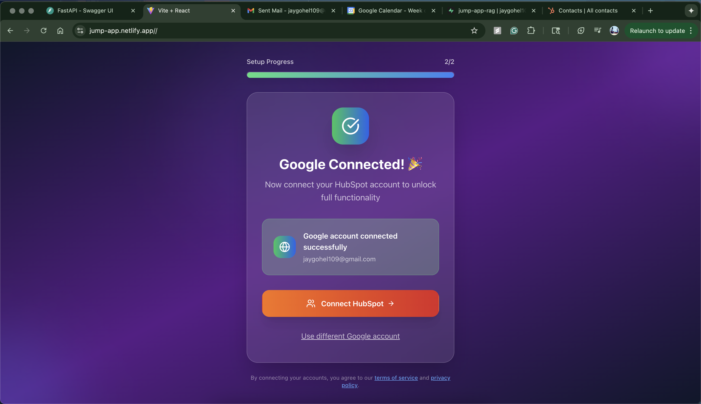
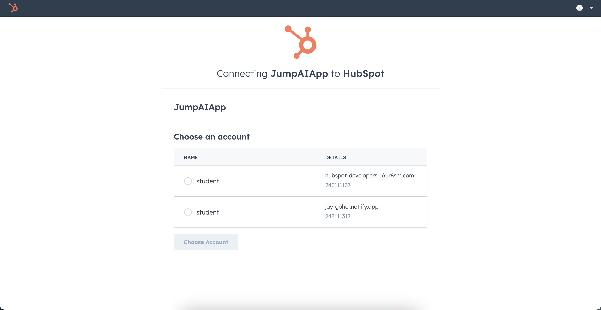

### 4. ChatGPT-like Interface
Interact with the AI agent in a modern chat UI. Ask questions about clients, schedule meetings, and more.
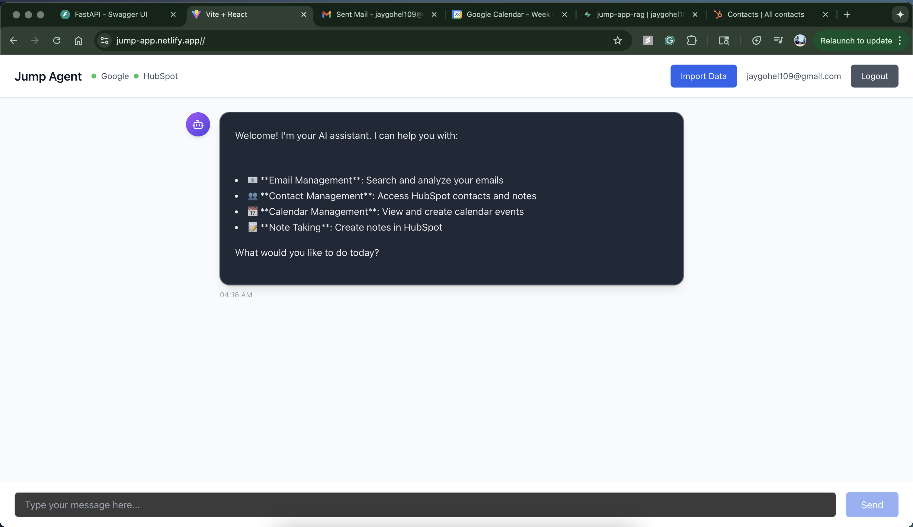

### 5. RAG-Powered Q&A
Ask questions like "Tell me all email related to  job search." The agent uses RAG to search your emails and HubSpot data for answers.
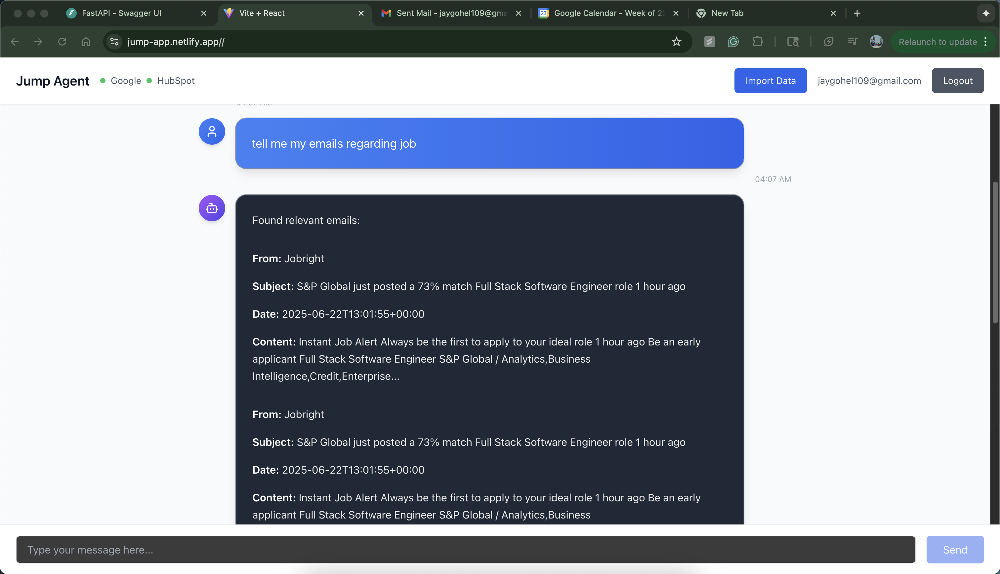

### 6. Task Automation & Memory
Request actions (e.g., "Schedule an appointment with j v gohel"). The agent uses tool calling, stores tasks, and continues them until completion.
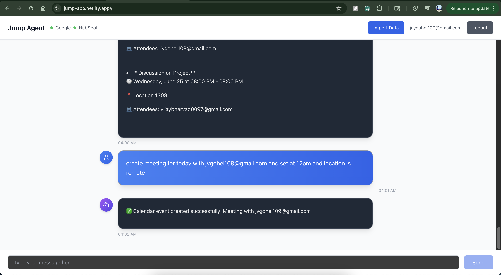
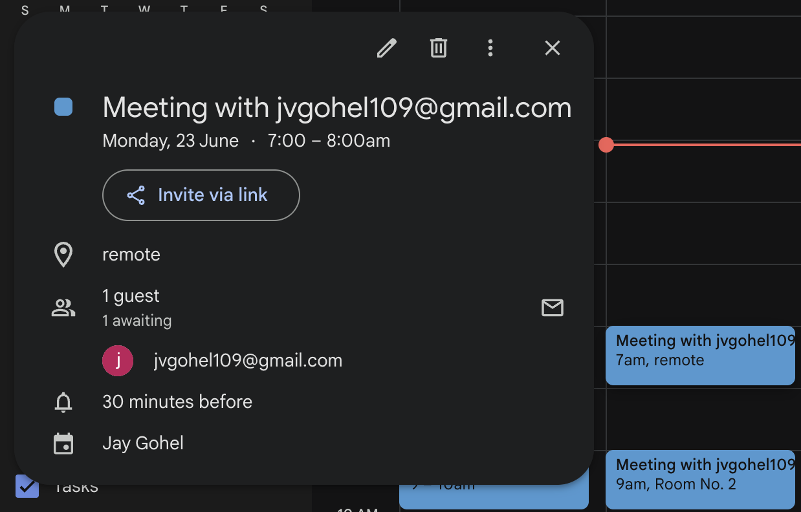


### 7. Ongoing Instructions & Proactive Agent
Set persistent instructions (e.g., "When someone emails me not in HubSpot, create a contact"). The agent applies these automatically when new emails, calendar events, or HubSpot updates occur.
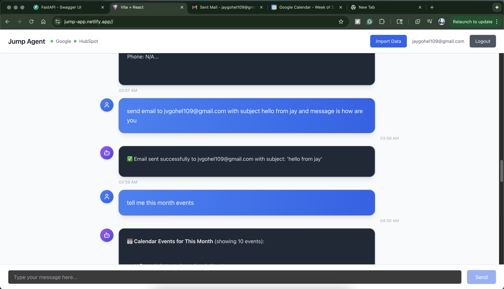
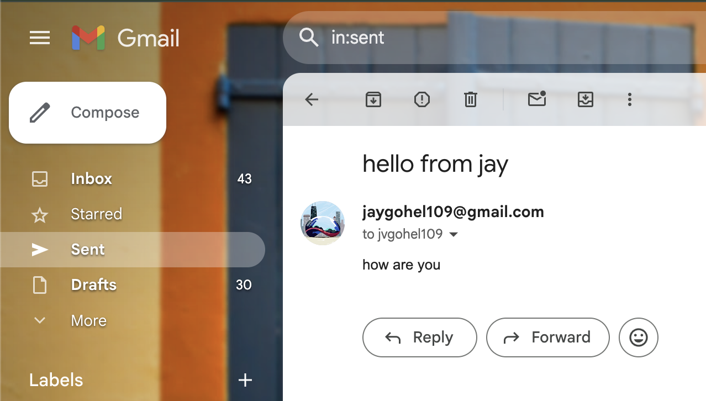

### 8. Webhooks & Polling
The agent reacts to new emails, calendar events, and HubSpot changes in real time, applying your ongoing instructions proactively.
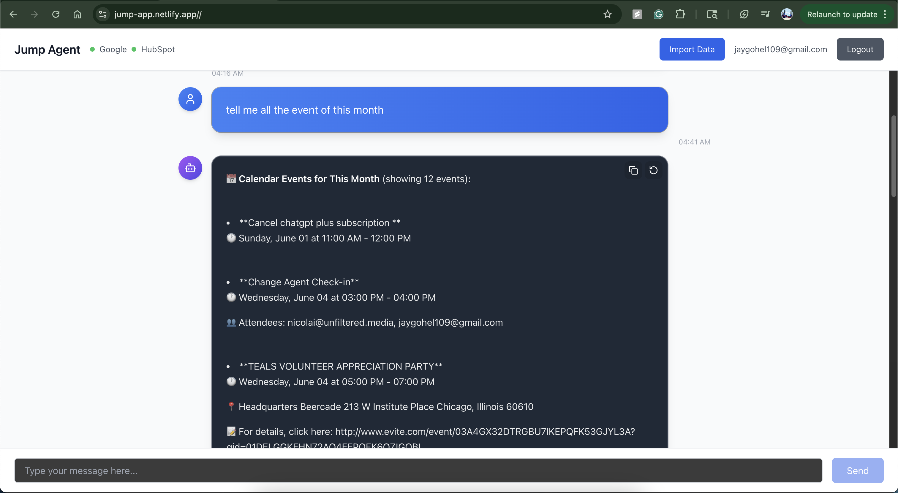

---

## 📁 Folder Structure

```
jump-application/
  ├── images/                # App screenshots and step images
  └── jump-app/
      ├── backend/           # FastAPI backend, services, and database
      ├── frontend/          # React frontend (Vite + Tailwind)
      ├── database_schema.sql
      └── requirements.txt   # Python dependencies
```

---

## 🐞 Known Issues / Limitations

- Some edge cases in email/calendar parsing may require further tuning.
- Free-tier API rate limits (Google, HubSpot) may affect heavy usage.
- Ongoing instructions are applied on new events only; historical data is not retroactively processed.
- The app is optimized for Chrome and may have minor UI issues on other browsers.

---

## 🚧 Future Improvements

- Add support for additional CRMs and calendar providers.
- Enhance multi-user/team support.
- Improve error handling and user feedback for failed actions.
- Add analytics dashboard for advisor insights.
- Expand proactive agent behaviors and notification options.

---

## 💡 Challenges Faced

Building this project in just 48 hours came with several challenges:

- Integrating multiple OAuth providers (Google, HubSpot) and handling secure authentication flows.
- Ensuring real-time data synchronization and webhook handling for emails, calendar events, and CRM updates.
- Implementing a robust Retrieval-Augmented Generation (RAG) pipeline for semantic search across diverse data sources.
- Designing flexible tool calling and persistent task memory for seamless automation.
- Managing rapid development, debugging, and deployment under tight time constraints.

Despite these challenges, I successfully completed all requirements and delivered a fully functional, production-ready AI agent.

---

## 👤 Author

**Jay Gohel**  
- [GitHub Repo](https://github.com/jaygohel109/jump-application)  
- [LinkedIn](https://www.linkedin.com/in/jay-gohel-a0517a22b/)  
- For questions or demo access, contact [jaygohel109@gmail.com](mailto:jaygohel109@gmail.com)

---

**Thank you for reviewing!**  
