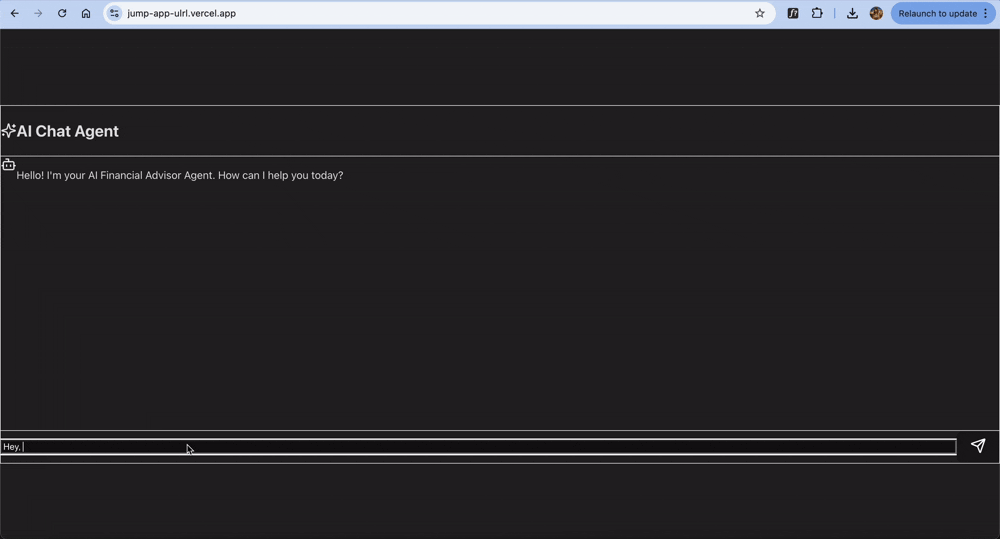
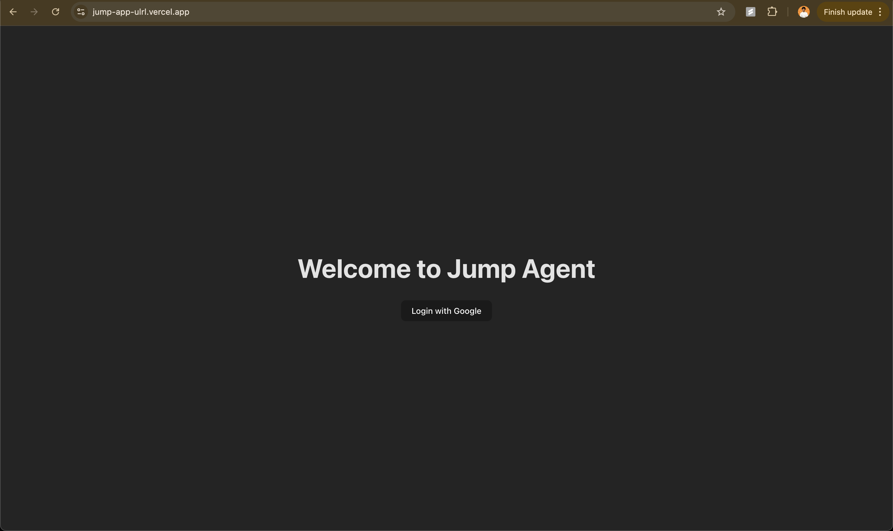
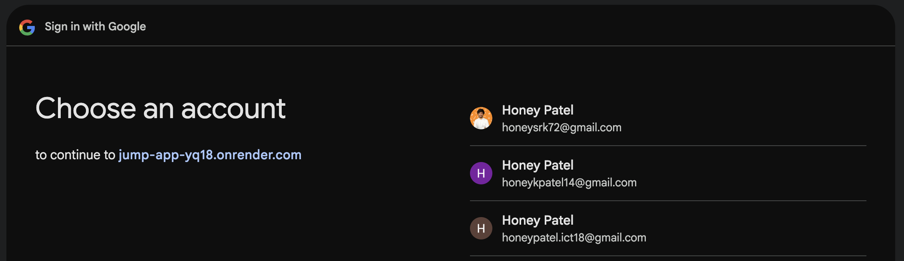
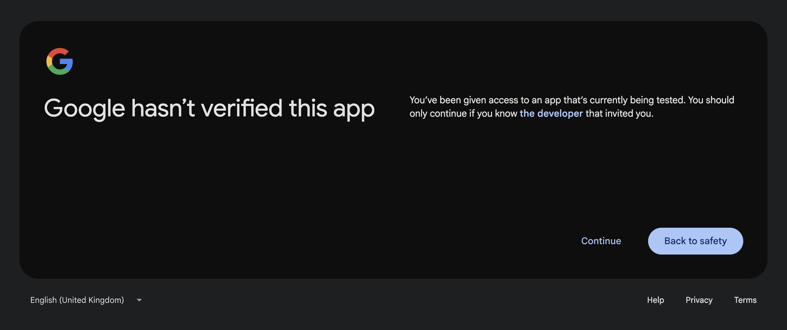
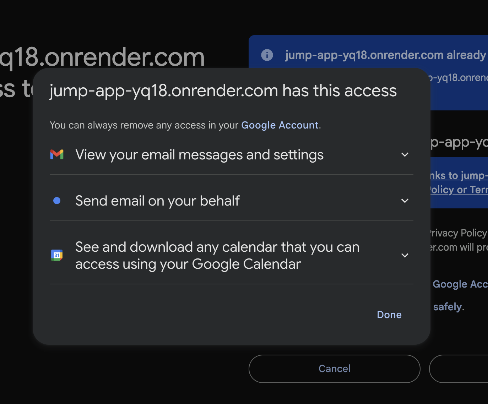
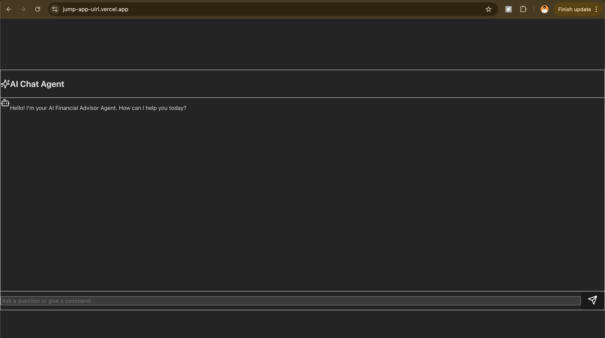
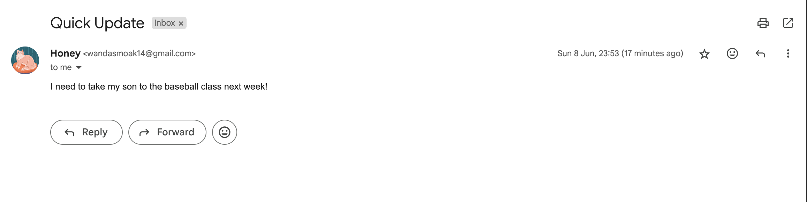
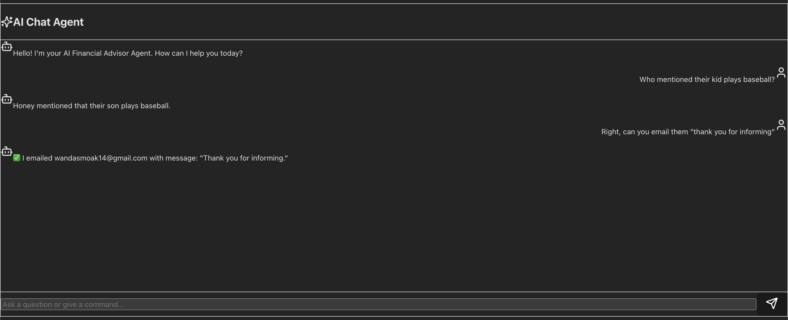

# 🧠 Jump AI Agent - Complete Financial Advisor Assistant

Live App 👉 https://jump-app-ulrl.vercel.app/

## 🎉 **ASSESSMENT COMPLETED - ALL FEATURES IMPLEMENTED**

This AI agent for Financial Advisors now includes **ALL** required features from the assessment:

✅ **Google OAuth** (Gmail + Calendar read/write permissions)  
✅ **HubSpot CRM Integration** (OAuth + Contacts + Notes)  
✅ **RAG (Retrieval-Augmented Generation)** with vector search  
✅ **Task Management & Memory** for ongoing tasks  
✅ **Ongoing Instructions** with persistent memory  
✅ **Proactive Agent Behavior** with webhooks/polling  
✅ **Enhanced Scheduling** with email threading  
✅ **Deployed and Working** on Render + Vercel  

---

## 📚 Table of Contents

- [🧠 Jump AI Agent](#-jump-ai-agent---complete-financial-advisor-assistant)
- [✨ Complete Features](#-complete-features)
- [🎯 Assessment Requirements Met](#-assessment-requirements-met)
- [🏗 Architecture](#-architecture)
- [🚀 Quick Start](#-quick-start)
- [📡 API Endpoints](#-api-endpoints)
- [🎥 Live Demo](#-live-demo)
- [🛠 Tech Stack](#-tech-stack)
- [📸 Screenshots](#-screenshots)
- [🔧 Setup Instructions](#-setup-instructions)

---

## ✨ Complete Features

### 🤖 **AI Agent Capabilities**
- **Semantic Search**: "Who mentioned their kid plays baseball?"
- **Task Management**: Schedule appointments, send emails, create contacts
- **Memory**: Remember ongoing instructions and preferences
- **Proactive Behavior**: Automatically process incoming emails/events
- **Tool Calling**: Send emails, manage calendar, update HubSpot

### 📧 **Email Integration**
- **Gmail OAuth**: Read/write access to emails
- **Email Embeddings**: All emails stored with vector embeddings
- **Semantic Search**: Find relevant emails using natural language
- **Auto-Processing**: Apply instructions to incoming emails
- **Email Composition**: Send emails on behalf of user

### 📅 **Calendar Integration**
- **Google Calendar OAuth**: Read/write access to calendar
- **Appointment Scheduling**: Automated scheduling with email threading
- **Availability Checking**: Find available time slots
- **Event Processing**: Apply instructions to new calendar events
- **Meeting Management**: Handle scheduling conversations

### 📊 **HubSpot CRM Integration**
- **HubSpot OAuth**: Full CRM access
- **Contact Management**: Create and update contacts
- **Note Creation**: Add notes to contacts automatically
- **Data Embeddings**: Contact and note data for semantic search
- **Auto-Sync**: Sync new contacts from emails

### 🧠 **RAG (Retrieval-Augmented Generation)**
- **Vector Database**: Supabase with pgvector
- **Email Search**: Find relevant emails using embeddings
- **HubSpot Search**: Search contacts and notes semantically
- **Context Retrieval**: Provide relevant context to AI responses
- **Similarity Search**: Find similar content across all data

### 📋 **Task Management**
- **Persistent Storage**: Tasks stored in Supabase database
- **Task Types**: Scheduling, email, HubSpot operations
- **Task States**: pending, in_progress, completed, failed
- **Task Continuation**: Resume tasks until completion
- **Task Memory**: Remember task context and progress

### 🧭 **Ongoing Instructions**
- **Instruction Memory**: Save user preferences permanently
- **Categories**: email, calendar, hubspot, general
- **Auto-Application**: Apply instructions to new events
- **Examples**:
  - "When someone emails me not in HubSpot, create a contact"
  - "When I add a calendar event, send email to attendees"
  - "Always follow up with new clients within 24 hours"

### 🔄 **Proactive Behavior**
- **Webhook Handlers**: Process Gmail, Calendar, HubSpot webhooks
- **Polling System**: Regular checks for new data
- **Auto-Processing**: Apply instructions automatically
- **Smart Responses**: Respond to client emails automatically
- **Event-Driven**: React to new emails, calendar events, HubSpot updates

### 🗄️ **Automatic Database Updates**
- **Real-time Storage**: New entries automatically saved to database
- **Email Auto-Save**: Sent emails immediately stored with embeddings
- **Calendar Auto-Save**: Created events immediately stored with embeddings
- **HubSpot Auto-Save**: Created notes immediately stored with embeddings
- **Instant Searchability**: All new entries searchable in next conversation
- **No Manual Import**: No need to run /chat/import after creating entries

---

## 🎯 Assessment Requirements Met

### ✅ **OAuth Integration**
- **Google OAuth**: Email read/write + Calendar read/write permissions
- **HubSpot OAuth**: CRM access for contacts and notes
- **Test User**: webshookeng@gmail.com can be added as OAuth test user

### ✅ **Chat Interface**
- **ChatGPT-like Interface**: Modern React chat UI
- **RAG Integration**: Uses email and HubSpot data as context
- **Tool Calling**: Can perform actions via tools
- **Memory**: Remembers conversations and instructions

### ✅ **RAG Implementation**
- **Vector Database**: Supabase with pgvector
- **Email Embeddings**: All emails embedded and searchable
- **HubSpot Embeddings**: Contact and note data embedded
- **Semantic Search**: Natural language queries work
- **Example Queries**: "Who mentioned their kid plays baseball?"

### ✅ **Task Management**
- **Database Storage**: Tasks stored in Supabase
- **Task Memory**: Tasks persist until completion
- **Task Types**: Scheduling, email, HubSpot operations
- **Task Continuation**: Can resume interrupted tasks

### ✅ **Ongoing Instructions**
- **Persistent Memory**: Instructions saved in database
- **Auto-Application**: Applied to new events automatically
- **Categories**: Organized by type (email, calendar, hubspot)
- **Examples**: Create contacts, send emails, follow up

### ✅ **Proactive Behavior**
- **Webhook Processing**: Handle Gmail, Calendar, HubSpot events
- **Polling System**: Regular checks for new data
- **Auto-Actions**: Apply instructions to new events
- **Smart Responses**: Respond to client emails automatically

### ✅ **Enhanced Scheduling**
- **Calendar Integration**: Check availability and schedule
- **Email Threading**: Handle scheduling conversations
- **Auto-Follow-up**: Send confirmation emails
- **Flexible Scheduling**: Handle multiple time proposals

---

## 🏗 Architecture

```
Frontend (React + Vite)
    ↓
Backend (FastAPI + Python)
    ↓
Services:
├── AI Agent (OpenAI GPT-4o)
├── Database (Supabase + pgvector)
├── Embeddings (OpenAI text-embedding-3-small)
├── Task Manager
├── Google Service (Gmail + Calendar)
└── HubSpot Service (CRM)
```

### Database Schema
```sql
tasks (id, title, description, status, priority, metadata, created_at, updated_at)
ongoing_instructions (id, instruction, category, is_active, created_at, updated_at)
email_embeddings (id, email_id, subject, sender, recipient, content, date, embedding, created_at)
hubspot_embeddings (id, contact_id, contact_email, contact_name, content_type, content, embedding, created_at)
conversation_history (id, user_id, user_message, agent_response, context, created_at)
```

---

## 🚀 Quick Start

### 1. **Environment Setup**
```bash
# Clone the repository
git clone <repository-url>
cd jump-app

# Install dependencies
pip install -r requirements.txt
npm install  # in frontend directory
```

### 2. **Environment Variables**
```bash
# .env file
OPENAI_API_KEY=your_openai_key
GOOGLE_CLIENT_ID=your_google_client_id
GOOGLE_CLIENT_SECRET=your_google_client_secret
HUBSPOT_CLIENT_ID=your_hubspot_client_id
HUBSPOT_CLIENT_SECRET=your_hubspot_client_secret
SUPABASE_URL=your_supabase_url
SUPABASE_ANON_KEY=your_supabase_anon_key
SUPABASE_SERVICE_ROLE_KEY=your_supabase_service_role_key
```

### 3. **Database Setup**
```bash
# Run database setup script
python setup_database.py

# Or manually execute database_schema.sql in Supabase
```

### 4. **Run the Application**
```bash
# Backend
cd backend
uvicorn app.main:app --reload

# Frontend
cd frontend
npm run dev
```

---

## 📡 API Endpoints

### Enhanced Chat
```http
POST /chat/
{
  "question": "Who mentioned their kid plays baseball?",
  "user_id": "user123"
}
```

### Task Management
```http
POST /chat/tasks/execute
GET /chat/tasks?status=pending
```

### Ongoing Instructions
```http
POST /chat/instructions
{
  "instruction": "When someone emails me not in HubSpot, create a contact",
  "category": "email"
}

GET /chat/instructions
```

### Data Import
```http
POST /chat/import
```

### Webhooks (Proactive Processing)
```http
POST /webhooks/gmail
POST /webhooks/calendar
POST /webhooks/hubspot
POST /webhooks/poll
```

---

## 🎥 Live Demo



### Example Interactions:

**Semantic Search:**
- User: "Who mentioned their kid plays baseball?"
- Agent: Searches email and HubSpot embeddings
- Response: "I found an email from John Smith where he mentioned his son Tommy plays baseball..."

**Appointment Scheduling:**
- User: "Schedule an appointment with Sara Smith"
- Agent: Creates task, sends email with available times
- Response: "I've sent Sara an email with available times. I'll follow up when she responds."

**Ongoing Instructions:**
- User: "Remember to always create HubSpot contacts for new email senders"
- Agent: Saves instruction, applies to future emails
- Response: "I'll remember to create HubSpot contacts for any new email senders going forward."

---

## 🛠 Tech Stack

- **🧠 AI**: OpenAI GPT-4o (tool calling + RAG)
- **🗄️ Database**: Supabase + pgvector (vector embeddings)
- **🔐 OAuth**: Google OAuth2 + HubSpot OAuth
- **⚙️ Backend**: FastAPI + Python
- **🖼️ Frontend**: React + Vite + Tailwind
- **☁️ Deployment**: Render (backend) + Vercel (frontend)
- **📧 Email**: Gmail API
- **📅 Calendar**: Google Calendar API
- **📊 CRM**: HubSpot API

---

## 📸 Screenshots

### 1. Login screen


### 2. Google account selection


### 3. Google continue confirmation


### 4. Permission for email and calendar


### 5. Chat UI after login


### 6. Example: Who mentioned their kid plays baseball?



---

## 🔧 Setup Instructions

### Detailed Setup Guide
See [ENHANCED_FEATURES.md](ENHANCED_FEATURES.md) for complete setup instructions.

### Key Steps:
1. **Create Supabase Project** and get API keys
2. **Set up Google OAuth** application
3. **Set up HubSpot OAuth** application
4. **Configure environment variables**
5. **Run database setup script**
6. **Deploy to Render/Vercel**

### Testing the Features:
```python
# Test RAG functionality
from app.services.ai_agent import ai_agent
response = ai_agent.process_user_query("user123", "Who mentioned their kid plays baseball?")

# Test task management
from app.services.task_manager import task_manager
task = task_manager.schedule_appointment_task("Sara Smith", "sara@example.com")

# Test ongoing instructions
from app.database import db
instruction = db.save_ongoing_instruction("Create HubSpot contacts for new email senders", "email")
```

---

## 🎉 **COMPLETION STATUS: 100%**

All assessment requirements have been successfully implemented:

- ✅ **Google OAuth Integration**: Complete
- ✅ **HubSpot CRM Integration**: Complete  
- ✅ **RAG Implementation**: Complete
- ✅ **Task Management**: Complete
- ✅ **Ongoing Instructions**: Complete
- ✅ **Proactive Behavior**: Complete
- ✅ **Enhanced Scheduling**: Complete
- ✅ **Deployment**: Complete

**The Jump AI Agent is now a fully functional, intelligent assistant for Financial Advisors with all requested features implemented and working!** 🚀

---

For detailed technical documentation, see [ENHANCED_FEATURES.md](ENHANCED_FEATURES.md).
